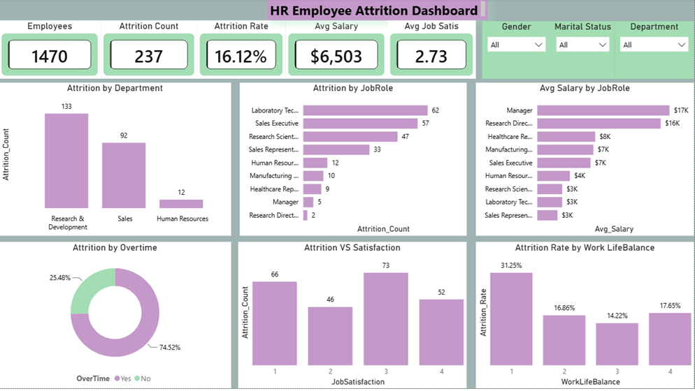
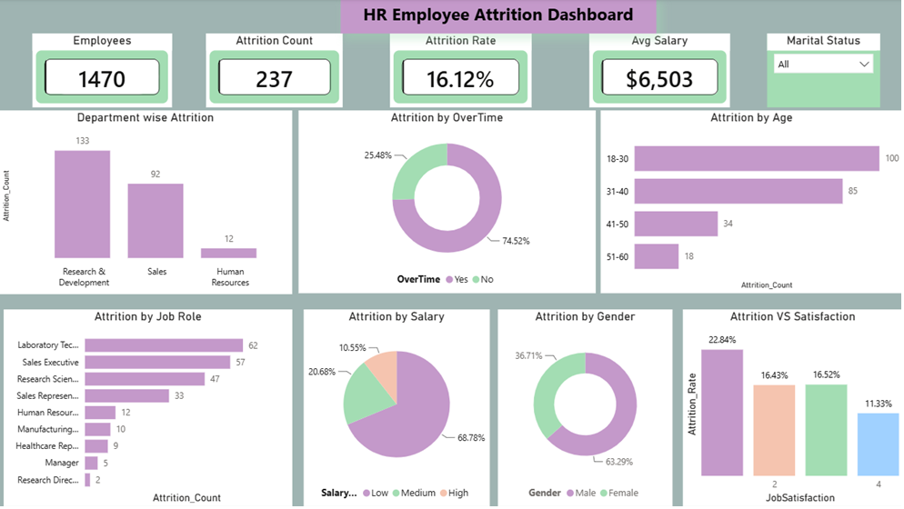
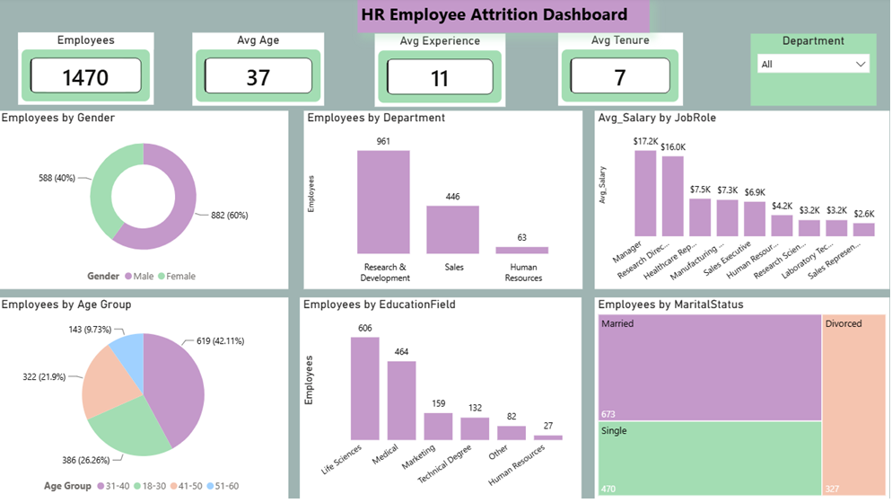
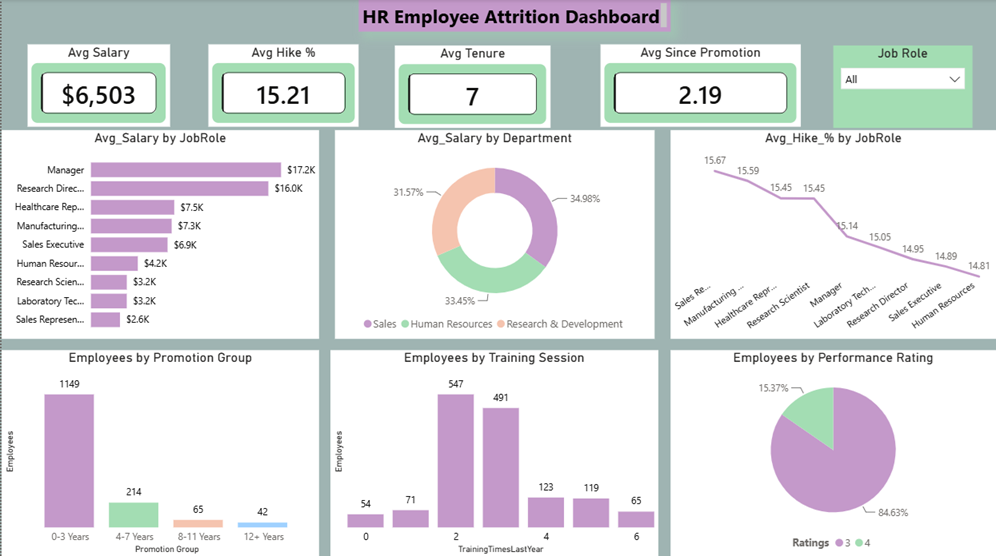
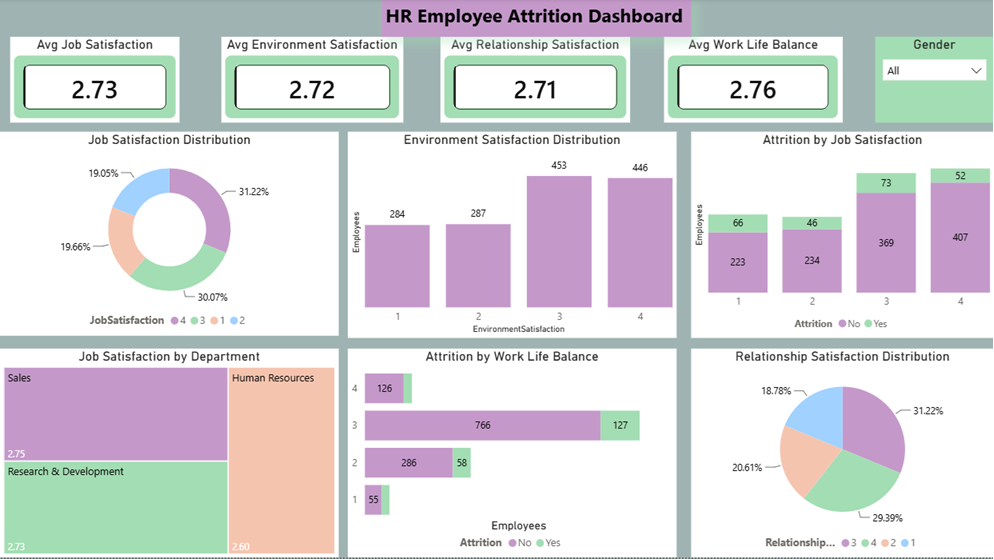

# HR Employee Attrition Analysis

## 📌 Project Overview

This End-to-End HR Analytics project analyzes employee attrition using **SQL, Python, and Power BI**. The objective is to identify the major factors contributing to employee turnover and provide actionable business insights to improve employee retention and workforce management.

The project covers data cleaning, exploratory data analysis (EDA), SQL-based business analysis, and an interactive multi-page Power BI dashboard.

---

# 🎯 Business Objective

- Analyze employee attrition trends.
- Identify departments and job roles with high attrition.
- Understand the impact of salary, overtime, age, and satisfaction.
- Analyze workforce demographics.
- Provide business recommendations to improve employee retention.

---

# 🛠️ Tools & Technologies

- MySQL
- Python (Pandas, NumPy, Matplotlib, Seaborn)
- Power BI
- DAX
- Microsoft Excel

---

# 📊 Dataset Overview

| Metric | Value |
|--------|------:|
| Total Employees | 1,470 |
| Employees Left | 237 |
| Attrition Rate | 16.12% |
| Average Salary | $6,503 |
| Average Job Satisfaction | 2.73 |

---

# 🔄 Project Workflow

## 1️⃣ Data Preparation

- Cleaned and validated HR employee data.
- Performed Exploratory Data Analysis (EDA) using Python.
- Created meaningful employee segments.
- Checked missing values and data quality.

---

## 2️⃣ Python Exploratory Data Analysis

Performed detailed EDA including:

- Employee Distribution
- Attrition Distribution
- Department Analysis
- Salary Distribution
- Age Distribution
- Correlation Analysis
- Work-Life Balance
- Job Satisfaction
- Environment Satisfaction

---

## 3️⃣ SQL Business Analysis

Solved business questions including:

- Overall Attrition Rate
- Department-wise Attrition
- Job Role-wise Attrition
- Attrition by Salary
- Attrition by Age Group
- Overtime Impact
- Work-Life Balance Analysis
- Promotion Gap Analysis
- Marital Status Analysis
- Gender Analysis
- Employee Distribution
- Compensation Analysis
- Satisfaction Analysis

---

## 4️⃣ Power BI Dashboard

Designed an interactive dashboard consisting of:

- Executive Summary
- Attrition Analysis
- Workforce Overview
- Compensation & Career Growth
- Satisfaction & Engagement

Dashboard Features

- KPI Cards
- Interactive Filters
- Drill-down Analysis
- Dynamic Charts
- Business Insights

---

# 📈 Key Business Insights

- Overall Attrition Rate is **16.12%**
- Research & Development records the highest number of employee exits.
- Employees working overtime show significantly higher attrition.
- Employees aged **18–30** experience the highest attrition.
- Lower salary groups have higher employee turnover.
- Poor Work-Life Balance is associated with higher attrition.
- Sales Executive and Laboratory Technician roles show high employee exits.

---

# 💼 Business Recommendations

- Reduce excessive overtime.
- Improve work-life balance initiatives.
- Review salary structure for lower salary bands.
- Develop retention programs for young employees.
- Increase employee engagement and satisfaction.
- Focus on high-risk departments and job roles.

---

# 📸 Dashboard Screenshots

## Executive Summary


---

## Attrition Analysis



---

## Workforce Overview



---

## Compensation & Career Growth



---

## Satisfaction & Engagement



---

# 📂 Repository Structure

```
HR-Employee-Attrition-Analysis
│
├── Employees.csv
├── HR_Analytics_SQL_Project.sql
├── HR_Analytics_EDA_Python.ipynb
├── HR_Analytics_Dashboard.pbix
├── Attrition_Analysis.png
├── Workforce_Overview.png
├── Compensation_Career_Growth.png
├── Satisfaction_Engagement.png
├── Executive_Summary.png
└── README.md
```

---

# ⭐ Skills Demonstrated

- SQL Data Analysis
- Exploratory Data Analysis (Python)
- Data Cleaning
- Business Analytics
- Data Visualization
- Power BI Dashboard Development
- DAX Measures
- Business Insight Generation

---

# 👩‍💻 Author

**Gunjan Rana**

Aspiring Data Analyst skilled in SQL, Python, Power BI, Excel, and Data Visualization.

---

## ⭐ If you found this project useful, don't forget to star this repository!
